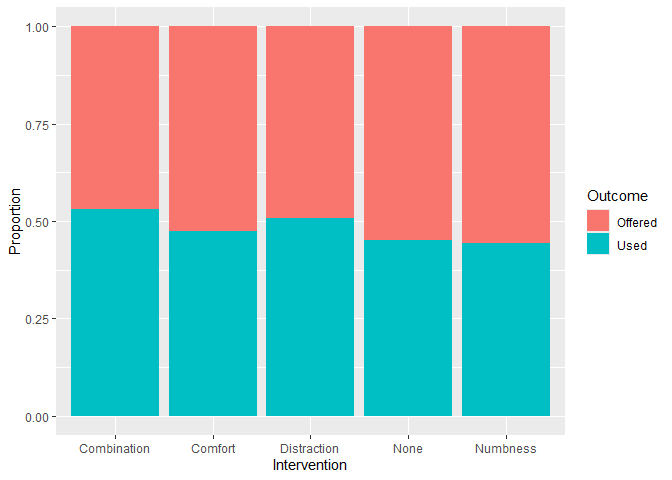

yunopasta
================
2024-04-01

``` r
## brilliant code goes here.

library(tidyverse)
```

    ## ── Attaching core tidyverse packages ──────────────────────── tidyverse 2.0.0 ──
    ## ✔ dplyr     1.1.4     ✔ readr     2.1.5
    ## ✔ forcats   1.0.0     ✔ stringr   1.5.1
    ## ✔ ggplot2   3.5.0     ✔ tibble    3.2.1
    ## ✔ lubridate 1.9.3     ✔ tidyr     1.3.1
    ## ✔ purrr     1.0.2     
    ## ── Conflicts ────────────────────────────────────────── tidyverse_conflicts() ──
    ## ✖ dplyr::filter() masks stats::filter()
    ## ✖ dplyr::lag()    masks stats::lag()
    ## ℹ Use the conflicted package (<http://conflicted.r-lib.org/>) to force all conflicts to become errors

``` r
PropUsed<-matrix(c(138,143,97,90,87,87,14,14,53,51),nrow=5,byrow=T)
colnames(PropUsed)<-c("Offered","Used")
rownames(PropUsed)<-c("None","Numbness","Distraction","Comfort","Combination")
PropUsed
```

    ##             Offered Used
    ## None            138  143
    ## Numbness         97   90
    ## Distraction      87   87
    ## Comfort          14   14
    ## Combination      53   51

``` r
addmargins(prop.table(PropUsed))
```

    ##                Offered       Used        Sum
    ## None        0.17829457 0.18475452 0.36304910
    ## Numbness    0.12532300 0.11627907 0.24160207
    ## Distraction 0.11240310 0.11240310 0.22480620
    ## Comfort     0.01808786 0.01808786 0.03617571
    ## Combination 0.06847545 0.06589147 0.13436693
    ## Sum         0.50258398 0.49741602 1.00000000

``` r
PropUsed_df<- cbind(as_tibble(prop.table(PropUsed)), 
                                Intervention = c("None","Numbness","Distraction","Comfort","Combination"))

PropUsed_df <- PropUsed_df %>% 
  pivot_longer(!Intervention, names_to = "Outcome", values_to = "Proportion")

PropUsed_df
```

    ## # A tibble: 10 × 3
    ##    Intervention Outcome Proportion
    ##    <chr>        <chr>        <dbl>
    ##  1 None         Offered     0.178 
    ##  2 None         Used        0.185 
    ##  3 Numbness     Offered     0.125 
    ##  4 Numbness     Used        0.116 
    ##  5 Distraction  Offered     0.112 
    ##  6 Distraction  Used        0.112 
    ##  7 Comfort      Offered     0.0181
    ##  8 Comfort      Used        0.0181
    ##  9 Combination  Offered     0.0685
    ## 10 Combination  Used        0.0659

``` r
ggplot(PropUsed_df, aes(x = Intervention, y = Proportion, fill = Outcome)) +
  geom_bar(stat = "identity", position = 'fill')
```

<!-- -->

``` r
chisq.test(PropUsed)
```

    ## 
    ##  Pearson's Chi-squared test
    ## 
    ## data:  PropUsed
    ## X-squared = 0.3688, df = 4, p-value = 0.985
